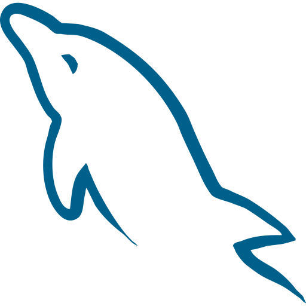
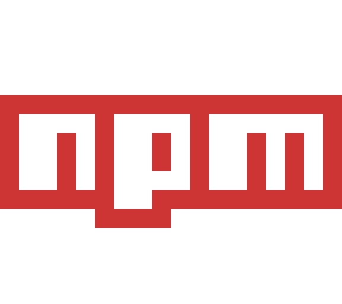
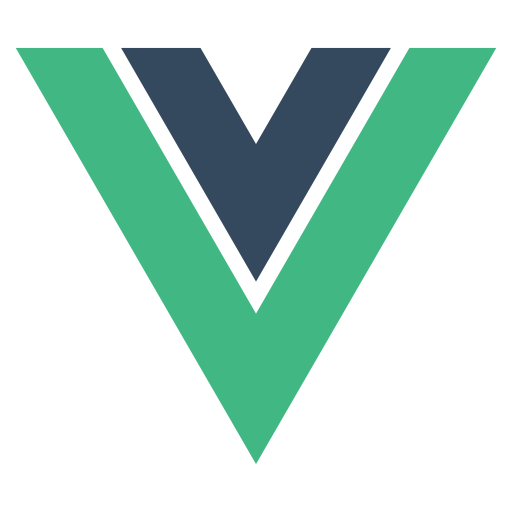

<h1 align="center">
  
</h1>

<h5 align="center">
  <code><a href="https://www.linkedin.com/in/sryaagung" title="LinkedIn Profile"> LinkedIn</a></code>
  <code><a href="https://instagram.com/sryaagung?igshid=OGQ5ZDc2ODk2ZA==" title="Instagram Profile"> Instagram</a></code>
  <code><a href="https://instagram.com/sryaagung?igshid=OGQ5ZDc2ODk2ZA==" title="Instagram Profile"> Facebook</a></code>
</h5>
 

  Hi, I'm Surya Agung, a Software Engineering Student at IPB University, Indonesia
   
   
  📚 Currently pursuing my Bachelor's degree in Software Engineering
   
  🎓 Graduated from SMK Informatika Pesat with a focus on Software Engineering
   
  💻 I'm passionate about coding and eager to learn all things related to it
   
  🌟 My goal is to become a proficient programmer, specializing in both front-end and back-end techniques. I have a strong commitment to maintaining code quality and structure.
   
  👥 I thrive in collaborative team environments, believing that 'two heads are better than one.'
   
  💬 Feel free to reach out to me with any questions or discussions. You can find me on <a href="mailto:suryaagung118@gmail.com">suryaagung118@gmail.com</a>.
   
  📫 You can contact me via email at <a href="mailto:suryaagung118@gmail.com">suryaagung118@gmail.com</a>

<h2 align="center">🔥 Languages & Frameworks & Tools & Abilities 🔥</h2>
 

  <code></code>
  <code></code>
  <code></code>
  <code></code>
  <code></code>
  <code></code>
  <code></code>
  <code></code>
  <code></code>
  <code></code>
  <code></code>
  <code></code>
  <code></code>
  <code></code>
  <code></code>
  <code></code>
  <code></code>
  <code></code>
  <code></code>
  <code></code>
  <code></code>
  <code></code>
  <code></code>

<!--
**suryaagung-Z/suryaagung-Z** is a ✨ _special_ ✨ repository because its `README.md` (this file) appears on your GitHub profile.

Here are some ideas to get you started:

- 🔭 I’m currently working on ...
- 🌱 I’m currently learning ...
- 👯 I’m looking to collaborate on ...
- 🤔 I’m looking for help with ...
- 💬 Ask me about ...
- 📫 How to reach me: ...
- 😄 Pronouns: ...
- ⚡ Fun fact: ...
-->
