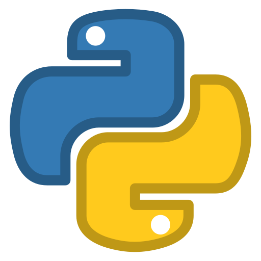
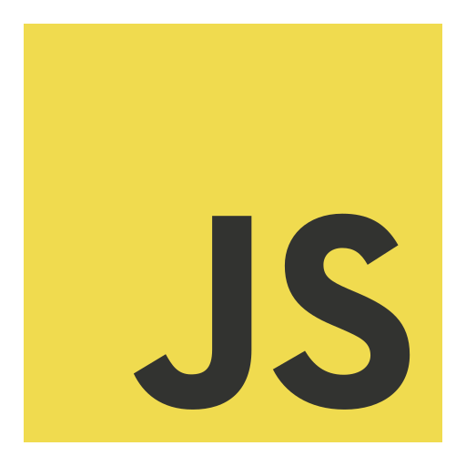
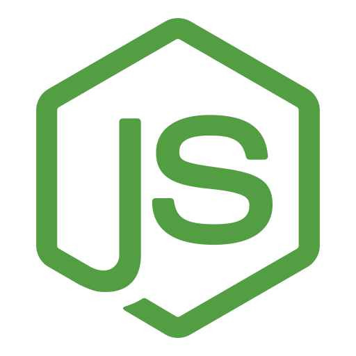
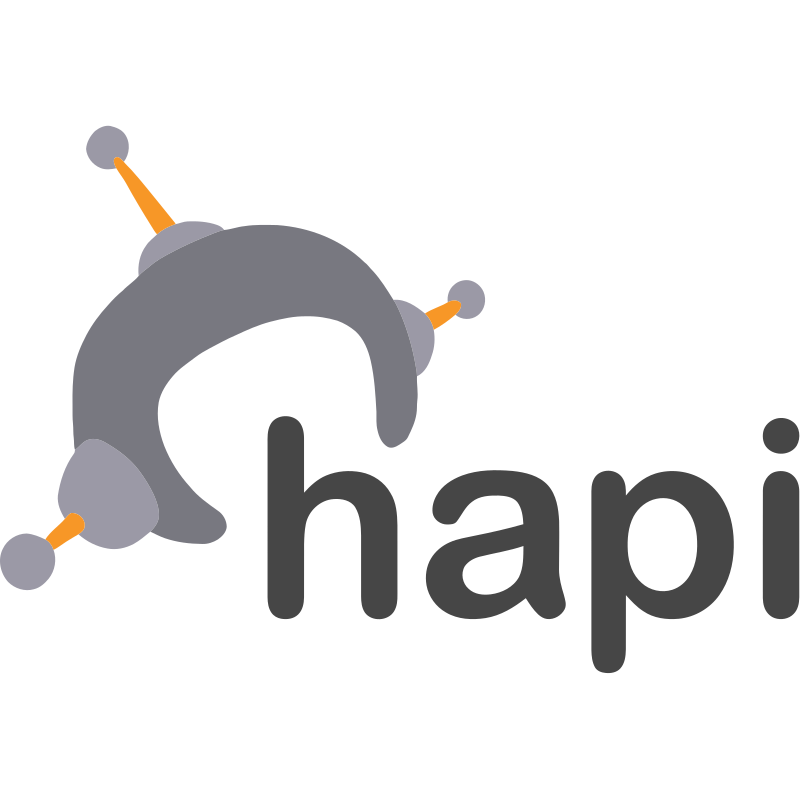
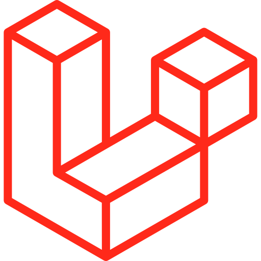
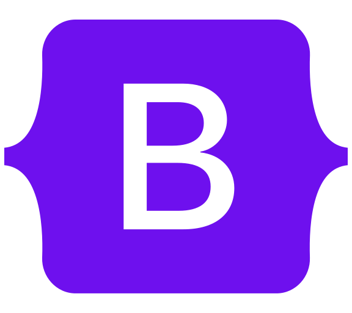
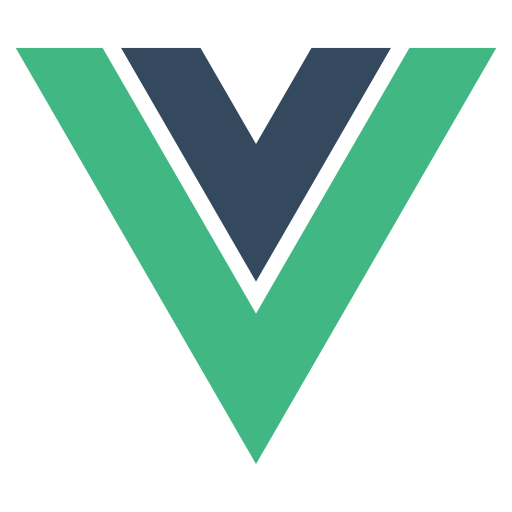
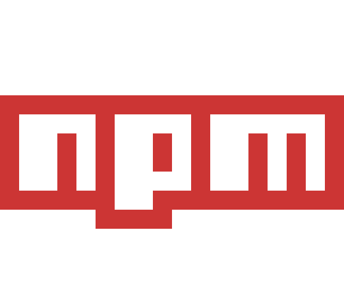

<h1 align="center">
    
</h1>

<h5 align="center">
  <code><a href="https://www.linkedin.com/in/sryaagung" title="LinkedIn Profile"> LinkedIn</a></code>
  <code><a href="https://instagram.com/sryaagung?igshid=OGQ5ZDc2ODk2ZA==" title="Instagram Profile"> Instagram</a></code>
  <code><a href="https://instagram.com/sryaagung?igshid=OGQ5ZDc2ODk2ZA==" title="Instagram Profile"> Facebook</a></code>
</h5>
 

  Hi, I'm Surya Agung, a Software Engineering Student at <strong>IPB University</strong>, Indonesia
    
  📚 Pursuing a Bachelor's degree in Software Engineering.
   
  🎓 Graduated from <strong>SMK Informatika Pesat</strong> with a focus on Software Engineering
   
  💻 Passionate about coding and eager to learn more.
   
  👥 Thrive in collaborative team environments. Feel free to reach out at <a href="mailto:suryaagung118@gmail.com">suryaagung118@gmail.com</a> for questions or discussions.

<strong>Languages:</strong>

  <code></code>
  <code></code>
  <code></code>
  <code></code>

 

<strong>Backend Development:</strong>

  <code></code>
  <code></code>
  <code></code>
  <code></code>
  <code></code>
  <code></code>

 

<strong>Front-End Development:</strong>

  <code></code>
  <code></code>
  <code></code>
  <code></code>
  <code></code>
  <code></code>
  <code></code>
  <code></code>
  <code></code>

 

<strong>Databases:</strong>

  <code></code>
  <code></code>
  <code></code>

 

<strong>Tools & Platforms:</strong>

  <code></code>
  <code></code>
  <code></code>
  <code></code>

